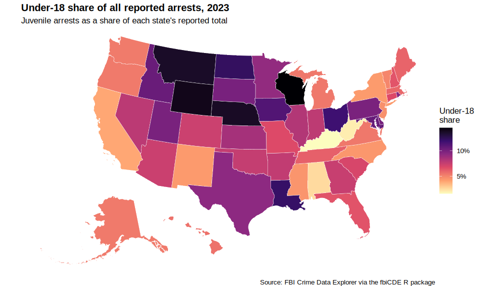
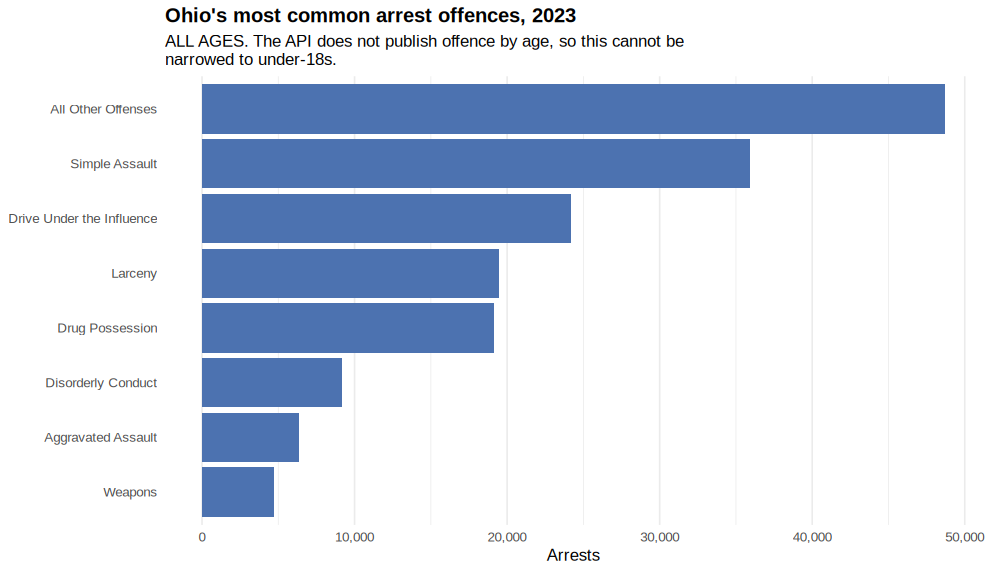
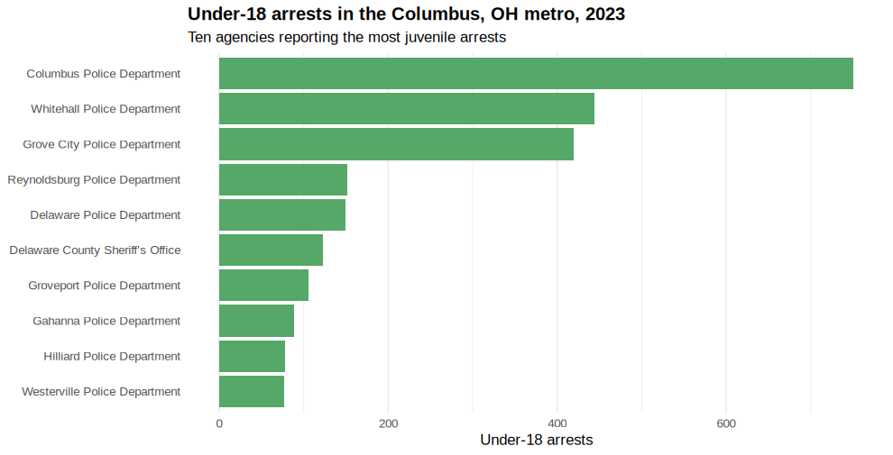

This vignette works a single question all the way down the geographic ladder:
**how many people under 18 are arrested, and where?**

It starts with all 50 states, narrows to one city police department, and ends
with every department in that city's metropolitan area. Along the way it shows
what the CDE API can and cannot answer, because both matter when you are
building an analysis you intend to defend.

Every figure here comes from live API calls made on
2026-10-05; see [Reproducing this](#reproducing-this).


```r
library(fbiCDE)
```

## 1. What counts as a juvenile arrest?

The CDE reports arrestee age in buckets, split by sex. Pull them for one state
and look at what comes back:


```r
oh <- get_arrest_demographics(state_abb = "OH", from = "01-2023", to = "12-2023")

unique(oh$demographic_type)
#> [1] "Arrestee Sex"          "Arrestee Race"         "Male Arrests By Age"  
#> [4] "Female Arrests By Age"

age <- oh[grepl("By Age", oh$demographic_type), ]
sort(unique(age$demographic_value))
#>  [1] "10-12"          "11-12"          "13-14"          "15"            
#>  [5] "16"             "17"             "18"             "19"            
#>  [9] "20"             "21"             "22"             "23"            
#> [13] "24"             "25-29"          "30-34"          "35-39"         
#> [17] "40-44"          "45-49"          "50-54"          "55-59"         
#> [21] "60-64"          "65 and over"    "Adult Other"    "Juvenile Other"
#> [25] "Under 10"       "Under 11"
```

A juvenile is anyone under 18, which here means every bucket up to and
including `17`, plus the explicit `Juvenile Other` category.

Two traps are worth knowing about before you sum anything.

**The API emits two bucket vintages at once.** You will see both `Under 10` and
`Under 11`, and both `10-12` and `11-12`. These overlap. In practice only one
vintage is populated and the other is zero-filled, so including all of them is
safe — but if you hand-pick a subset you can easily double count. Check before
you trust it:


```r
overlap <- age[age$demographic_value %in% c("Under 10", "Under 11", "10-12", "11-12"), ]
stats::aggregate(count ~ demographic_value, data = overlap, FUN = sum)
#>   demographic_value count
#> 1             10-12  2159
#> 2             11-12     0
#> 3          Under 10   131
#> 4          Under 11     0
```

**`Adult Other` is not a juvenile bucket** despite sitting next to
`Juvenile Other` alphabetically.

With that established, a small helper:


```r
JUVENILE_BUCKETS <- c(
  "Under 10", "Under 11", "10-12", "11-12",
  "13-14", "15", "16", "17", "Juvenile Other"
)

juvenile_summary <- function(demographics) {
  age <- demographics[grepl("By Age", demographics$demographic_type), ]
  data.frame(
    juvenile = sum(age$count[age$demographic_value %in% JUVENILE_BUCKETS]),
    total    = sum(age$count)
  )
}

oh_summary <- juvenile_summary(oh)
oh_summary
#>   juvenile  total
#> 1    22260 187953
```

Ohio reported 22,260 arrests of under-18s in 2023, out of
187,953 arrests in total.

## 2. All 50 states

`get_arrest_demographics()` takes a state abbreviation, so the national picture
is one call per state:


```r
states <- datasets::state.abb

state_juvenile <- do.call(rbind, lapply(states, function(s) {
  d <- get_arrest_demographics(state_abb = s, from = "01-2023", to = "12-2023")
  cbind(state = s, juvenile_summary(d))
}))

state_juvenile$share <- state_juvenile$juvenile / state_juvenile$total
head(state_juvenile[order(-state_juvenile$share), ], 5)
#>    state juvenile  total     share
#> 49    WI    28896 199010 0.1451987
#> 50    WY     2676  19001 0.1408347
#> 27    NE     6642  48243 0.1376780
#> 26    MT     4152  30319 0.1369438
#> 34    ND     4050  32876 0.1231902
```


### Why share, and not a rate per capita

Mapping raw counts would mostly draw a population map — California would win
every year. The obvious fix is arrests per 100,000 juveniles, but the CDE does
not publish a juvenile population, and inventing one from another source
introduces a denominator whose vintage and geography may not match.

**Juvenile share of all arrests** avoids that entirely. It is self-normalising,
uses only figures from the same response, and answers a question people
actually ask: of everyone arrested here, what fraction were children?


```r
library(ggplot2)

state_sf <- tigris::states(cb = TRUE, resolution = "20m", progress_bar = FALSE)
state_sf <- state_sf[state_sf$STUSPS %in% state_juvenile$state, ]
state_sf <- merge(state_sf, state_juvenile, by.x = "STUSPS", by.y = "state")

# shift_geometry() repositions Alaska and Hawaii; without it a CONUS-centred
# projection throws them into the corners at the wrong scale.
state_sf <- tigris::shift_geometry(state_sf)

ggplot(state_sf) +
  geom_sf(aes(fill = share), colour = "white", linewidth = 0.15) +
  scale_fill_viridis_c(
    labels = scales::percent, name = "Under-18\nshare",
    option = "magma", direction = -1
  ) +
  labs(
    title = "Under-18 share of all reported arrests, 2023",
    subtitle = "Juvenile arrests as a share of each state's reported total",
    caption = "Source: FBI Crime Data Explorer via the fbiCDE R package"
  ) +
  theme_void(base_size = 11) +
  theme(plot.title = element_text(face = "bold"))
```

<div class="figure">

<p class="caption">plot of chunk choropleth</p>
</div>

### Read this map carefully

The spread runs from about 1.6% to 14.5% — a
9-fold difference. That is far too wide to be
credible as a real difference in how often children commit crimes, so
**something other than behaviour is driving most of it.** The next step is to
find out what.

The obvious suspect is incomplete reporting, so check it. The arrest response
reports, for every month, the state's `population` and the
`participated_population` covered by agencies that reported that month. Their
ratio over the year is the share of the state's people whose arrests are in
the count:


```r
coverage <- do.call(rbind, lapply(state_juvenile$state, function(s) {
  a <- get_arrest_count(state_abb = s, from = "01-2023", to = "12-2023")
  data.frame(state = s,
             coverage = sum(a$participated_population) / sum(a$population))
}))

state_juvenile <- merge(state_juvenile, coverage, by = "state")
summary(state_juvenile$coverage)
#>    Min. 1st Qu.  Median    Mean 3rd Qu.    Max. 
#>  0.6373  0.9505  0.9893  0.9599  0.9973  1.0000

coverage_cor <- cor(state_juvenile$share, state_juvenile$coverage)
round(coverage_cor, 3)
#> [1] -0.012
```

This is not the same as NIBRS participation, the share of a state's agencies
that report through NIBRS. Agencies still on the older summary system report
arrests too: Pennsylvania has under a fifth of its agencies on NIBRS, yet its
arrests cover
96% of its
population.

Coverage is high almost everywhere — the median state reports for
98.9% of its population — and its
correlation with juvenile share is -0.01, so coverage is
*not* the explanation. Kentucky reports the lowest juvenile
share in the country with
100%
of its population covered:


```r
cols <- c("state", "juvenile", "total", "share", "coverage")
head(state_juvenile[order(state_juvenile$share), cols], 5)
#>    state juvenile  total      share  coverage
#> 17    KY     3267 202329 0.01614697 1.0000000
#> 49    WV      669  32484 0.02059475 0.9061234
#> 2     AL     3679 142285 0.02585656 0.9668559
#> 5     CA    30956 778357 0.03977095 0.9808664
#> 34    NY    16125 372558 0.04328185 0.9906259
```

What the data does establish is narrow but useful: **the spread is not
explained by how completely a state's agencies report.** It does not tell us
what does explain it.

One plausible hypothesis is structural -- states differ in whether a juvenile
taken into custody is recorded as an *arrest* in the UCR sense at all, since
juvenile justice systems are separate and their dispositions differ. That is a
hypothesis this data cannot confirm, and it is offered as a direction to
investigate rather than a finding.

The defensible conclusion is the conservative one: this map should not be read
as a ranking of juvenile offending, and any use of it needs to establish what
each state actually counts before comparing them.

Always keep coverage beside the number:


```r
low <- state_juvenile[state_juvenile$coverage < 0.9, cols]
low[order(low$coverage), ]
#>    state juvenile  total      share  coverage
#> 25    MS     2711  59999 0.04518409 0.6373427
#> 9     FL    15284 234394 0.06520645 0.8296835
#> 29    NE     6642  48243 0.13767801 0.8491194
#> 15    IN    10512 134022 0.07843488 0.8580829
#> 50    WY     2676  19001 0.14083469 0.8831401
#> 41    SD     4710  46954 0.10031094 0.8860466
#> 32    NM     2278  52293 0.04356224 0.8913880
```

## 3. Arrests by offence, and a gap in the API

The natural next question is *which offences* juveniles are arrested for. As of
2026 the CDE API cannot answer it.

The arrest endpoint returns **independent marginals**, not a cross-tabulation:
offence totals across all ages, and age totals across all offences. There is no
offence-by-age table, so `get_arrest_demographics()` accepts only
`offense = "all"`:


```r
get_arrest_demographics(state_abb = "OH", offense = "Larceny")
#> Error: Only offense = "all" is supported for get_arrest_demographics(). The CDE API provides arrest demographics aggregated across all offenses and does not break them down by offense. Use get_arrest_count() for per-offense arrest counts.
```

This is a change in what the FBI publishes through the API, not a limit on what
is collected — the underlying records contain both fields. Filling the gap from
the FBI's bulk downloads is tracked as Gitea issue #58.

`get_nibrs_offender()` does give age by offence, but in ten-year buckets where
`10-19` straddles the age of majority, so it cannot isolate under-18s:


```r
nib <- get_nibrs_offender(
  state_abb = "OH", offense = "BUR", variable = "age",
  from = "01-2023", to = "12-2023"
)
nib$demographic_value
#>  [1] "0-9"      "10-19"    "20-29"    "30-39"    "40-49"    "50-59"   
#>  [7] "60-69"    "70-79"    "80-89"    "Unknown"  "90-Older"
```

So the offence breakdown below is **all ages**, and is labelled as such. It is
not a juvenile figure.

`get_arrest_count()` returns a monthly time series when `offense = "all"`, and a
single total when you name an offence. The CDE names offences at three levels
of detail — offence names, categories and breakdowns — and within one level
the counts do not overlap, so ranking offences means ranking one level. The
offence-name level has 34 entries:


```r
offense_names <- list_ucr_arrest_offenses(level = "name")
length(offense_names)
#> [1] 34
head(offense_names, 10)
#>  [1] "Aggravated Assault"                  "All Other Offenses"                 
#>  [3] "Arson"                               "Burglary"                           
#>  [5] "Counterfeiting/Forgery"              "Curfew and Loitering Law Violations"
#>  [7] "Disorderly Conduct"                  "Drive Under the Influence"          
#>  [9] "Drug Abuse Violations"               "Drug Possession"
```


```r
offense_counts <- do.call(rbind, lapply(offense_names, function(o) {
  get_arrest_count(state_abb = "OH", offense = o,
                   from = "01-2023", to = "12-2023")
}))

offense_counts <- offense_counts[order(-offense_counts$count), c("offense", "count")]
rownames(offense_counts) <- NULL
head(offense_counts, 10)
#>                      offense count
#> 1         All Other Offenses 48673
#> 2             Simple Assault 35930
#> 3  Drive Under the Influence 24197
#> 4                    Larceny 19500
#> 5            Drug Possession 19163
#> 6         Disorderly Conduct  9151
#> 7         Aggravated Assault  6374
#> 8                    Weapons  4695
#> 9      Liquor Law Violations  3702
#> 10                 Vandalism  3669

# The offence names partition all arrests:
sum(offense_counts$count)
#> [1] 188836
```


Two names need care. `All Other Offenses` is the catch-all for everything
without its own line, and it is the largest. And drug arrests are split:
`Drug Possession` and `Drug Sale/Manufacturing` hold almost all of them, while
`Drug Abuse Violations` is only the remainder classed as neither
(880
in Ohio). The category `"Drug/Narcotic Offenses"` gives the total:
20,997.


```r
top$offense <- factor(top$offense, levels = rev(top$offense))

ggplot(top, aes(x = count, y = offense)) +
  geom_col(fill = "#4c72b0") +
  scale_x_continuous(labels = scales::comma) +
  labs(
    title = "Ohio's most common arrest offences, 2023",
    subtitle = "ALL AGES. The API does not publish offence by age, so this cannot be
narrowed to under-18s.",
    x = "Arrests", y = NULL
  ) +
  theme_minimal(base_size = 11) +
  theme(plot.title = element_text(face = "bold"),
        panel.grid.major.y = element_blank())
```

<div class="figure">

<p class="caption">plot of chunk offense-plot</p>
</div>

## 4. One agency: Columbus Police Department

Agency-level queries use an ORI, the CDE's 9-character agency identifier. Look
it up rather than guessing:


```r
agencies <- fbi_api_agencies
agencies[agencies$state_abbr == "OH" &
           agencies$agency_name == "Columbus Police Department",
         c("ori", "agency_name", "agency_type_name", "county_name")]
#>             ori                agency_name agency_type_name
#> 12198 OHCOP0000 Columbus Police Department             City
#>                         county_name
#> 12198 DELAWARE; FAIRFIELD; FRANKLIN
```

Two things in that row are worth pausing on.

`OHCOP0000` has letters where you might expect digits. That is normal — many
ORIs do — and it is a poor guide to what kind of agency you have. Ohio uses the
same shape for `OHCIP0000` (Cincinnati Police), `OHCLP0000` (Cleveland Police)
and `OHOHP0000`, which *is* the State Highway Patrol. Use `agency_type_name`,
not the ORI, to tell them apart.

Second, `county_name` lists **three** counties. Columbus straddles Delaware,
Fairfield and Franklin. That matters in section 5.

Before trusting a year's total, check that the agency reported every month:


```r
cbus_months <- get_arrest_count("OHCOP0000", from = "01-2023", to = "12-2023")
nrow(cbus_months)
#> [1] 12
range(cbus_months$count)
#> [1] 568 711
```

All twelve months are there, so what follows is not a partial year.


```r
columbus <- get_arrest_demographics(
  ori = "OHCOP0000", from = "01-2023", to = "12-2023"
)

juvenile_summary(columbus)
#>   juvenile total
#> 1      751  7693
```

The full age profile, rather than just the total:


```r
cbus_age <- columbus[grepl("By Age", columbus$demographic_type), ]
cbus_age <- stats::aggregate(count ~ demographic_value, data = cbus_age, FUN = sum)
cbus_age[cbus_age$demographic_value %in% JUVENILE_BUCKETS, ]
#>    demographic_value count
#> 1              10-12    49
#> 2              11-12     0
#> 3              13-14   217
#> 4                 15   166
#> 5                 16   157
#> 6                 17   162
#> 24    Juvenile Other     0
#> 25          Under 10     0
#> 26          Under 11     0
```

## 5. Every department in the Columbus area

A city police department is not the same thing as a city. Columbus PD covers
the incorporated city; the surrounding metro contains dozens of other agencies,
each reporting separately.

`metro_agencies()` resolves a metropolitan statistical area to the union of its
member counties' agencies:


```r
metro <- metro_agencies("Columbus, OH")

nrow(metro)
#> [1] 96
table(metro$agency_class)
#> 
#>         campus county_primary      municipal        special 
#>              5             10             77              4
```

Note Columbus PD appears **once**, even though it polices three counties that
are all in this metro. Deduplication matters here: without it the city's
arrests would be counted three times. Its row is attributed to the first of
those counties, and `agency_county_names` keeps all three:


```r
sum(metro$ori == "OHCOP0000")
#> [1] 1
metro[metro$ori == "OHCOP0000", c("county_name", "agency_county_names")]
#>    county_name           agency_county_names
#> 11    DELAWARE DELAWARE; FAIRFIELD; FRANKLIN
```

Now fan out over the agencies the package's geography functions query by
default — sheriffs, city police and campus police — leaving out transit,
special-purpose and state agencies. There is no arrest version of
`get_metro_crime_detail()`, so this loops directly, and keeps a record of any
agency whose request fails rather than dropping it silently:


```r
members <- metro[metro$agency_class %in% c("county_primary", "municipal", "campus"), ]

failed <- character(0)
metro_juvenile <- do.call(rbind, lapply(seq_len(nrow(members)), function(i) {
  d <- tryCatch(
    get_arrest_demographics(ori = members$ori[i], from = "01-2023", to = "12-2023"),
    error = function(e) {
      failed <<- c(failed, members$ori[i])
      NULL
    }
  )
  if (is.null(d)) return(NULL)
  cbind(
    agency = members$agency_name[i],
    class  = members$agency_class[i],
    juvenile_summary(d)
  )
}))

nrow(metro_juvenile)
#> [1] 92
failed
#> character(0)
sum(metro_juvenile$total > 0)
#> [1] 65
```

Not every agency reports. Of the 92 agencies queried,
27 returned no arrests at all — which may mean
a genuine zero or may mean they did not report, and the two are not the same
claim. Keep them visible rather than dropping them silently.


```r
reporting <- metro_juvenile[metro_juvenile$total > 0, ]
reporting$share <- reporting$juvenile / reporting$total

top10 <- head(reporting[order(-reporting$juvenile), ], 10)
top10[, c("agency", "class", "juvenile", "total", "share")]
#>                              agency          class juvenile total      share
#> 10       Columbus Police Department      municipal      751  7693 0.09762121
#> 28      Whitehall Police Department      municipal      444  4306 0.10311194
#> 25     Grove City Police Department      municipal      419  1808 0.23174779
#> 19   Reynoldsburg Police Department      municipal      152  1203 0.12635079
#> 2        Delaware Police Department      municipal      149   573 0.26003490
#> 1  Delaware County Sheriff's Office county_primary      123   640 0.19218750
#> 31      Groveport Police Department      municipal      106   170 0.62352941
#> 23        Gahanna Police Department      municipal       89   601 0.14808652
#> 26       Hilliard Police Department      municipal       78   603 0.12935323
#> 9     Westerville Police Department      municipal       77   490 0.15714286
```


```r
top10$agency <- factor(top10$agency, levels = rev(top10$agency))

ggplot(top10, aes(x = juvenile, y = agency)) +
  geom_col(fill = "#55a868") +
  scale_x_continuous(labels = scales::comma) +
  labs(
    title = "Under-18 arrests in the Columbus, OH metro, 2023",
    subtitle = "Ten agencies reporting the most juvenile arrests",
    x = "Under-18 arrests", y = NULL
  ) +
  theme_minimal(base_size = 11) +
  theme(plot.title = element_text(face = "bold"),
        panel.grid.major.y = element_blank())
```

<div class="figure">

<p class="caption">plot of chunk metro-plot</p>
</div>

### The payoff


```r
metro_total <- sum(reporting$juvenile)
city_total  <- reporting$juvenile[reporting$agency == "Columbus Police Department"]
city_share  <- city_total / metro_total

c(metro = metro_total, city = city_total, city_share = round(city_share, 3))
#>      metro       city city_share 
#>   3207.000    751.000      0.234
```

**Columbus PD accounts for 23% of juvenile arrests in its
own metropolitan area.** An analysis that queried only the city department
would miss 77% of them. That is the argument for the
geographic layer: the boundary you query is a methodological choice, and the
CDE will happily let you pick the wrong one without complaint.

Note also that share and volume rank differently. Some small suburban agencies
report juvenile shares several times the city's, on much smaller totals:


```r
# Restrict to agencies with enough arrests for a share to mean anything.
sizable <- reporting[reporting$total >= 100, ]
head(sizable[order(-sizable$share), c("agency", "juvenile", "total", "share")], 5)
#>                                                  agency juvenile total
#> 31                          Groveport Police Department      106   170
#> 65                      Madison County Sheriff's Office       50   185
#> 2                            Delaware Police Department      149   573
#> 43 Madison Township  Police Department, Franklin County       65   280
#> 25                         Grove City Police Department      419  1808
#>        share
#> 31 0.6235294
#> 65 0.2702703
#> 2  0.2600349
#> 43 0.2321429
#> 25 0.2317478
```

## Caveats worth carrying forward

- **A zero is not the same as "did not report".** The arrest endpoint does not
  distinguish them; `get_county_crime_detail()` and its siblings do, via a
  `reported` flag, and every series function returns the
  `participated_population` that shows how much of a population reported.
  Prefer those when the distinction matters.
- **Juvenile share is not a clean behavioural measure.** The spread across
  states is not credible as pure behavioural variation, and reporting coverage
  does not explain it. What does remains an open question, so do not rank
  states on this figure.
- **Offence-by-age is unavailable from the API.** Any juvenile-by-offence figure
  you see elsewhere came from bulk files or a different vintage.
- **Metro membership is attribution, not spatial truth.** An agency is included
  because it is attributed to a member county, not because its jurisdiction has
  been intersected with the metro boundary.

## Reproducing this

Every figure here comes from live API calls. The vignette is precomputed —
`vignettes/juvenile-arrests.Rmd.orig` holds the source and is knitted to
`.Rmd` by `data-raw/precompute_vignettes.R` — so building the package never
touches the network. Re-run that script to refresh against current data;
the numbers will move as agencies backfill.
